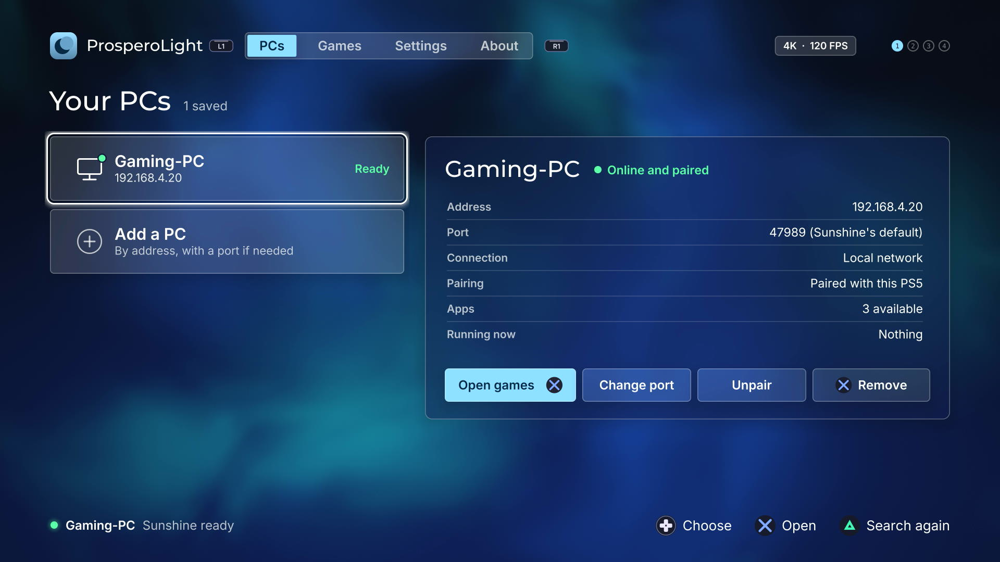

<p align="center">
  
</p>

<h1 align="center">ProsperoLight</h1>

> **Beta: [01.000.080](https://github.com/blackbearreloaded/ProsperoLight/releases/tag/01.000.080).**
> A new launcher drawn by the GPU, up to four controllers, a Sunshine port per PC, and settings
> and pairing kept in `/data/prosperolight`. The streaming engine is the one of the 01.000.070
> performance beta; the PS5 decoder still limits how much bitrate is usable: see
> [Bitrate limits](#bitrate-limits).
> [01.000.060 remains stable](https://github.com/blackbearreloaded/ProsperoLight/releases/tag/01.000.060).
> Please report results and regressions through [GitHub issues](https://github.com/blackbearreloaded/ProsperoLight/issues), using the checklist in the beta release notes.

<p align="center">
  <strong>A native Moonlight client for PlayStation 5 homebrew</strong><br>
  Stream Sunshine applications with hardware video decoding, low-latency input,
  selectable stereo or 5.1 surround audio, and a controller-first interface.
</p>

<p align="center">
  
  
  
  
  
  <a href="LICENSE"></a>
</p>



The picture shows the launcher running on a PlayStation 5 with a paired Sunshine host.

## Highlights

- Native PS5 hardware streaming through VideoDec2 and AGC at 1080p, 1440p,
  and 2160p, with independently selectable 60, 90, and 120 FPS stream targets.
- Decoding and presentation on separate threads: a late flip never holds back
  decoding, and every display refresh shows the newest decoded frame. See the
  [measured bitrate limits](#bitrate-limits) before raising the bitrate.
- H.264 High, HEVC Main, and HEVC Main10 HDR10 support at every available
  resolution.
- Low-latency DualSense input for up to four controllers, physical USB keyboard
  and mouse, controller-driven mouse mode, and an on-screen password keyboard.
- Automatic Sunshine discovery, manual address and port entry, persistent
  multi-PC pairing, application artwork, and launch/resume/stop controls.
- Persistent stream preferences, edge-to-edge or TV-safe presentation,
  independent frame-rate selection, and bitrate presets from 10 to 500 Mbps.
- Selectable 48 kHz stereo or 5.1 surround Opus audio, a sound for every
  launcher widget, live performance metrics, and graceful connection recovery.

ProsperoLight is a native PS5 client for the open Moonlight/Sunshine streaming
protocol. Its OpenGL launcher discovers and pairs with Sunshine hosts, browses
their applications, and starts a native streaming session. Video access units
are decoded by PS5 VideoDec2 and the resulting GPU-visible surfaces are
presented by AGC without copying decoded pixels through a CPU framebuffer.

> [!IMPORTANT]
> ProsperoLight does not run on an unmodified retail console. It is intended
> for consoles you own with an already configured, compatible homebrew loader.
> This repository does not include an exploit, proprietary Sony SDK, system
> module, encryption key, firmware file, or game asset.

## Bitrate limits

> [!WARNING]
> **A higher bitrate is not always better.** The PS5 video decoder takes longer
> for larger frames. Past the limits below it cannot keep up: latency grows,
> then the stream freezes about once a second. At 4K and 120 FPS, set
> **80 Mbps or lower**.


| 4K HEVC stream | Smooth up to | Freezes above | Recommended setting |
| --- | --- | --- | --- |
| 120 FPS | 80 Mbps | 100 Mbps | **80 Mbps** or lower |
| 90 FPS | 115 Mbps | 145 Mbps | **100 Mbps** or lower |
| 60 FPS | 115 Mbps | about 190 Mbps (extrapolated) | **100 Mbps**; 150 Mbps is not measured |
| 1440p and 1080p, any frame rate | at least the 4K values | not measured yet | as for 4K |

- **The numbers are the bitrate the host actually delivers.** The setting is a
  ceiling the encoder only reaches in busy scenes. One session at the 80 Mbps
  setting carried 24 Mbps; one at 300 Mbps carried about 160 Mbps.
- **Why there is a limit.** A 4K HEVC frame takes about 3.7 ms plus 45 µs per
  kilobyte to decode (5.5 ms plus 29 µs per kilobyte above roughly 105 KB). At
  120 FPS it must finish within 8.3 ms, which allows about 100 KB per frame:
  100 Mbps. A lower frame rate leaves more time per frame, so the limit rises.
- **What happens above it.** Frames wait in a queue, adding up to 0.15 s of
  delay. When 15 frames are waiting they are all discarded and a keyframe is
  requested. At the 300 Mbps setting this happened 13 times in 17 seconds, and
  the decoder still only managed 90 FPS.
- **How to tell.** With the overlay on (![Touchpad][touchpad] + ![R1][r1]), "Frames dropped
  by decoder backlog" rises and "Decode (last second)" shows a load near 100%.
  "Frames dropped by your network connection" is a different problem.
- The 300, 400 and 500 Mbps presets are beyond the 4K decoder at every frame rate.

Measured on a PS5 with HEVC SDR and eight slices per frame, decoding one frame
at a time (the default). HDR, H.264 and the lower resolutions are not measured
yet. `python3 tools/plot-bitrate-limits.py` redraws the chart from the model;
[round 4](docs/PERFORMANCE_ROUND_4.md) has the measurements.

## Project foundation

> [!IMPORTANT]
> **Built on the [PS5 Native App Boilerplate](https://github.com/blackbearreloaded/ps5-native-app-boilerplate).**
> ProsperoLight preserves the template's C++20 structure, `.hpp` interfaces,
> reproducible clean-room runtime, native FSELF tooling, tests, safe folder
> deployment, and release automation.

> [!IMPORTANT]
> **Controller input work is documented in [PS5 Native Gamepad Input Research](https://github.com/blackbearreloaded/ps5-native-gamepad-input-research).**
> The companion repository records recovered native APIs, low-latency examples,
> and DualSense behavior that informed ProsperoLight's controller integration.

> [!IMPORTANT]
> **Video work is documented in [PS5 Hardware Video Decoding Research](https://github.com/blackbearreloaded/ps5-hardware-video-decoding-research).**
> The companion repository records VideoDec2, HEVC, HDR10, zero-copy AGC,
> resolution, and performance findings that informed the streaming presenter.

> [!IMPORTANT]
> **Audio work is documented in [PS5 Audio Decoding Research](https://github.com/blackbearreloaded/ps5-audio-decoding-research).**
> The companion repository records codec, AJM, hardware/firmware offload, and
> output-path research that informed ProsperoLight's audio integration.

The client uses the established
[moonlight-common-c](https://github.com/moonlight-stream/moonlight-common-c)
protocol implementation rather than reimplementing the wire protocol. The
launcher, stream coordination, PS5 input/audio/video integration, UI, and build
tooling are maintained in this repository.

| Identity | Value |
| --- | --- |
| Shell title | `ProsperoLight` |
| Title ID | `PPSA99002` |
| Category | Game |
| Beta / stable | `01.000.080` / `01.000.060` |
| Version source | [`sce_sys/param.json`](sce_sys/param.json) |
| Writable data | `/data/prosperolight` (`/download0` without an upstream Lapy service) |

## Features

- Discover Sunshine hosts on the LAN or add an IPv4 address manually.
- Reach a Sunshine that does not use the default port 47989: each saved PC has
  its own port, and a discovered PC uses the port it advertises.
- Remember up to eight PCs, pairing identities, and stream preferences under
  `/data/prosperolight` across application restarts and updates.
- Pair with a two-minute PIN dialog with a countdown, and unpair after a
  confirmation.
- Tell you when a newer version is listed on
  [homebrew.page](https://homebrew.page): one notice for ten seconds, once per
  launch. Nothing is downloaded or installed.
- See every saved PC and its state in one list, and browse up to 64 advertised
  Sunshine applications as posters with launch/resume and stop controls.
- Decode H.264 High and HEVC Main streams through VideoDec2 at 1080p, 1440p,
  and 2160p. Select 60, 90, or 120 FPS independently of resolution and bitrate;
  live 1440p/90 and 2160p/120 Sunshine sessions are hardware-validated.
- Present decoded GPU surfaces directly through AGC, with edge-to-edge and
  television-safe display modes. At 60 FPS, 1440p is GPU-scaled into a
  3840x2160 target and 2160p is presented 1:1. High-refresh streams retain the
  same 4K output geometry: 1440p is GPU-scaled to 4K, while 2160p/120 is
  presented through the PS5's native 3840x2160 119.88 Hz output path.
- Set the bitrate from 10 to 300 Mbps on a slider. At 4K the Settings screen
  shows how close the bitrate is to the decoder's measured limit and warns
  above it.
- Choose V-Sync, the decoder pipeline (Classic, or the experimental Adaptive),
  and how many CPU cores decoding may use.
- Enable HEVC Main10 HDR10 output at any available resolution and frame-rate
  selection when the Sunshine host advertises support.
- Decode Moonlight Opus audio and output selectable 48 kHz stereo or 5.1
  surround through PS5 AudioOut.
- Forward low-latency DualSense controls, with controller/mouse switching and
  a stream keyboard that works at Windows sign-in.
- Play with up to four controllers: every user signed in on the PS5 is a
  separate controller on the PC, and controllers can join or leave mid-stream.
- Forward a physical USB keyboard and mouse directly to Sunshine during a
  stream, including modifiers, navigation/function keys, five mouse buttons,
  and vertical/horizontal scrolling.
- Show Moonlight-style stream metrics for resolution, codec, frame rates,
  packet loss, network/host latency, and decode time.
- Recover from connection failures and return from a stream to the launcher
  without leaving a stale session running.
- Use original 4K artwork, icon, loading presentation, and selection music.
- Use a launcher drawn by the GPU at up to 4K: frosted panels, the selected
  app's colours behind them, button glyphs in place of button names, and a
  sound for every move, choice, switch, dialog and notice.

## Current status

The complete 1080p60 path—pairing, application launch, VideoDec2/AGC video,
stereo audio, DualSense input, mouse mode, Windows sign-in keyboard, metrics,
return-to-launcher, relaunch, and cleanup—has been exercised on PS5 hardware
with Sunshine. Hardware runs also confirm HEVC 1440p-to-4K filtered GPU
presentation and native HEVC 2160p-to-4K presentation with the metrics HUD at
60 FPS. Bounded live sessions additionally confirm 2560x1440 at 90 FPS and
3840x2160 at 120 FPS from Sunshine. An isolated hardware oracle additionally
confirms native 3840x2160 119.88 Hz VideoOut presentation at 119.88 FPS.

ProsperoLight is still alpha software. HEVC, 1440p, 2160p, HDR, very high
bitrates, network recovery, and long gameplay sessions need broader validation
across GPUs, Sunshine configurations, networks, TVs, firmware versions, and
homebrew loaders. See the evidence and open acceptance items in
[Validation](docs/VALIDATION.md).

> [!IMPORTANT]
> Wired Ethernet is strongly recommended for reliable streaming, particularly
> at 1440p or 2160p, 90 or 120 FPS, and higher bitrates. Wi-Fi can work, but
> interference and variable latency may cause dropped frames or input delay.

## Requirements

Build from Linux, WSL, or a Linux CI runner. On Ubuntu, Debian, or WSL:

```bash
sudo apt update
sudo apt install curl git make pkg-config python3 python3-venv tar unzip wget \
  clang-18 clang-format-18 clang-tidy-18 llvm-18-dev lld-18 cmake
```

The build downloads and verifies its public PS5 Payload SDK, zlib, GoogleTest,
and packaging inputs below ignored `.deps/` directories. Initialize the pinned
streaming sources after cloning:

```bash
git submodule update --init --recursive
make doctor
```

Compressed `.ffpfsc` output requires Python 3.9 or newer with `venv` support.
The optional local `.ffpkg` target additionally requires .NET 8 or newer.
Nothing is installed globally by the project build.

See [Getting started](docs/GETTING_STARTED.md) and
[Native tooling](docs/NATIVE_TOOLING.md) for clean-machine setup details.

## Build

```bash
# Production release image; also assembles the complete title folder.
make ffpfsc

# Faster folder-only development build.
make
```

Outputs are written to:

```text
dist/PPSA99002/           complete title folder
dist/PPSA99002.ffpfsc     compressed installation image
```

Useful development gates are:

```bash
make test       # C++ unit/runtime, presentation ownership, report, and tooling checks
make test-stream-performance # Host-only scalar/SIMD FEC and Opus compatibility
make lint       # formatting, static analysis, metadata, asset, and shell checks
make check      # lint + every host test + complete folder build
make ffpfsc     # production folder + compressed image
```

An optional `make ffpkg` target remains available for local development. The
`.ffpkg` output is intentionally excluded from GitHub Actions and Releases.
See [Package formats](docs/FFPKG.md).

## GitHub Actions and releases

The [Build workflow](.github/workflows/tooling.yml) runs on every push to
`main`, pull request, version tag, and manual dispatch. It:

1. checks out all pinned submodules;
2. installs the public Linux/PS5 build prerequisites;
3. validates metadata and the release tag;
4. runs lint, GoogleTest, runtime-allocation, presentation/report guards, Python
   integration checks, and host-only scalar/SIMD FEC and Opus comparisons;
5. independently reproduces and verifies `runtime/libc.prx`;
6. builds `PPSA99002.ffpfsc` and archives the complete app folder as
   `PPSA99002.zip`; and
7. generates `SHA256SUMS` for both release formats and uploads all three files
   as the Actions artifact.

A tag matching the exact `contentVersion` verifies that build-time checksum
again, then publishes the `.ffpfsc` image, app-folder `.zip`, and `SHA256SUMS`.
`.ffpkg` builds are never attached to a release.

## Update an installed copy

1. Download either `PPSA99002.ffpfsc` or `PPSA99002.zip` from the latest GitHub
   release and verify it with `SHA256SUMS`.
2. Fully close ProsperoLight.
3. For the image form, replace the existing `PPSA99002.ffpfsc` in the directory
   scanned by ShadowMountPlus. For the folder form, extract `PPSA99002.zip` and
   upload its complete `PPSA99002` directory to `/data/homebrew/`, producing
   `/data/homebrew/PPSA99002/eboot.bin`. Do not upload the ZIP itself.
4. Restart ShadowMountPlus cleanly or restart the PS5, then wait for
   ShadowMountPlus to rediscover the title before launching it.
5. Launch ProsperoLight and confirm the new version below the title in the top
   bar.

Do not relaunch immediately after replacing the same pathname: ShadowMountPlus
may still have the previous image mounted. Pairing and settings are kept in
`/data/prosperolight` (see [Files on the console](#files-on-the-console)) and
are not touched by an update; Shell presentation metadata may remain cached.

## Deploy

For an already-running PS5 FTP service, stage the development folder with:

```bash
make deploy PS5_HOST=192.168.1.100
```

Fully close ProsperoLight before deploying. The deployer writes only the
current title below `/data/homebrew`, uploads through temporary names, and
publishes `eboot.bin` and `sce_sys/param.json` last. Upload the complete folder;
`eboot.bin` alone is not a valid deployment.

To test the packaged form instead:

```bash
make deploy PS5_HOST=192.168.1.100 DEPLOY_FORMAT=ffpfsc
```

ProsperoLight never changes PS5 system settings or configures a loader. See
[Deployment](docs/DEPLOYMENT.md) for the safe development loop and removal
behavior.

## Pairing and first stream

1. Start Sunshine on a PC connected to the same trusted LAN. Wired Ethernet
   for both the PC and PS5 is strongly recommended.
2. Open ProsperoLight and choose a discovered PC, or choose **Add a PC** and
   type its IPv4 address (see [Sunshine on another port](#sunshine-on-another-port)
   if Sunshine does not use port 47989).
3. Choose **Pair this PC**, then enter the displayed PIN in Sunshine within two
   minutes.
4. Open **Games**, choose Desktop or another advertised application, and press
   ![Cross][cross].
5. Press ![Touchpad][touchpad] + ![L1][l1] to end the stream and return to ProsperoLight.

Pairing credentials and settings are title-scoped. Installing under a different
title ID intentionally requires pairing again.

To forget an old PC, select it on **PCs**, move to **Remove** and hold
![Cross][cross] until the button fills. This works while the PC is offline and
removes only that saved entry; it does not revoke pairing on the host or affect
other saved PCs. Press ![Triangle][triangle] to search the network again, or
choose **Add a PC**, to find and pair with the replacement host. A host
advertising itself on the network may appear again after a search.

### Sunshine on another port

Sunshine listens on port 47989 unless its **Port** setting (Configuration →
Network in the Sunshine web UI) was changed. ProsperoLight keeps one port per
saved PC:

- A PC found on the network uses the port Sunshine advertises. Nothing needs
  to be typed.
- Select a PC on **PCs** and choose **Change port**. An empty entry restores
  47989.
- **Add a PC** also accepts an address with a port, for example
  `192.168.1.50:48989`.

Only this one number is needed: Sunshine derives its other ports from it and
reports them to ProsperoLight. The same address can be saved more than once
with different ports, for example for two Sunshine instances on one PC.

### More than one controller

Each user signed in on the PS5 plays with their own controller, up to four.
The user who started ProsperoLight is the first controller on the PC. To add a
player, turn on another controller and choose a user for it when the PS5 asks,
before or during a stream; a notification confirms that the controller joined.
A controller that is switched off, or whose user signs out, is removed from the
PC, and the next controller to join takes its place.

> [!TIP]
> For the smoothest 90 or 120 FPS result, choose the resolution, frame rate,
> codec, and bitrate before launching the Sunshine application. If you change
> them after returning to the launcher, stop the active application first and
> then launch it again so Sunshine creates a fresh capture/encoder session.
> Tune bitrate upward case by case; a higher value can reduce smoothness at
> 4K or high frame rates even when the network link is fast. The decoder's
> measured limits are under [Bitrate limits](#bitrate-limits).

## Controls

The icons are the controller's buttons. ![Touchpad][touchpad] is the touchpad button: press the
touchpad down until it clicks.

### Launcher

| Input | Action |
| --- | --- |
| ![D-pad][dpad] / left ![analog stick][stick] | Move focus or change the selected PC/application/setting |
| ![Cross][cross] | Activate, pair, launch, resume, or change a setting |
| ![Circle][circle] | Return to the PCs page |
| ![Square][square] | Stop the active Sunshine application |
| ![Triangle][triangle] | Search the network for Sunshine again |
| ![L1][l1] / ![R1][r1] | Change between PCs, Games, Settings, and About |
| ![Options][options] | Open Settings |

### Streaming

| Input | Action |
| --- | --- |
| ![Touchpad][touchpad] + ![R1][r1] | Toggle the metrics overlay |
| ![Touchpad][touchpad] + ![L1][l1] | End the stream and return to ProsperoLight |
| ![Touchpad][touchpad] + ![Square][square] | Toggle mouse/controller mode |
| ![Touchpad][touchpad] + ![Triangle][triangle] | Toggle ProsperoLight's stream keyboard |
| Physical USB keyboard | Forward keys and modifiers directly to Sunshine |
| Physical USB mouse | Move, click, and scroll directly on the Sunshine host |
| Either ![analog stick][stick] in mouse mode | Move the pointer |
| ![Cross][cross] / ![Circle][circle] / ![Square][square] in mouse mode | Left / right / middle mouse button |
| ![L1][l1] / ![R1][r1] in mouse mode | Mouse X1 / X2 button |
| ![D-pad][dpad] in mouse mode | Vertical / horizontal scroll |
| ![D-pad][dpad] while keyboard is open | Move between keys |
| ![Cross][cross] while keyboard is open | Type the selected key |
| ![Triangle][triangle] while keyboard is open | Toggle Shift |
| ![Square][square] while keyboard is open | Send Backspace |
| ![Options][options] while keyboard is open | Send Enter and close the keyboard |
| ![Circle][circle] while keyboard is open | Close the keyboard |

![Touchpad][touchpad] + ![R1][r1] and ![Touchpad][touchpad] + ![L1][l1] work on every controller. Mouse mode and
the stream keyboard belong to the first controller; on the others those two
shortcuts are ordinary button presses for the game.

[cross]: docs/images/buttons/cross.svg "Cross"
[circle]: docs/images/buttons/circle.svg "Circle"
[square]: docs/images/buttons/square.svg "Square"
[triangle]: docs/images/buttons/triangle.svg "Triangle"
[options]: docs/images/buttons/options.svg "Options"
[l1]: docs/images/buttons/l1.svg "L1"
[r1]: docs/images/buttons/r1.svg "R1"
[dpad]: docs/images/buttons/dpad.svg "D-pad"
[stick]: docs/images/buttons/stick.svg "Analog stick"
[touchpad]: docs/images/buttons/touchpad.svg "Touchpad button"

The stream keyboard contains every printable US-ASCII character used by
standard passwords. It is not currently a multilingual or Unicode input
method. Keyboard text is sent directly as Moonlight key events and is not
stored by ProsperoLight or written to its configuration.

## Files on the console

When it starts, ProsperoLight asks a separately loaded upstream Lapy owned-root
service for filesystem access (the method ProsperoEden uses, see
[`tooling/elevation`](tooling/elevation/README.md)). With it, everything the
app writes is in one folder that an update, a reinstall or a new title image
does not touch:

| Path | Contents |
| --- | --- |
| `/data/prosperolight/config/prosperolight-config.bin` | Saved PCs and stream settings |
| `/data/prosperolight/pairing/` | `cert.pem` and `key.pem`, the identity Sunshine paired with |
| `/data/prosperolight/logs/prosperolight-launcher.log` | This launch's log; the previous one is `prosperolight-launcher.prev.log` |
| `/data/prosperolight/logs/performance-last.json` | The last stream's performance report |
| `/data/prosperolight/logs/crash-last.txt` | Written only if the app crashes: where it happened |
| `/data/prosperolight/cache/` | The shaders the launcher compiled, so later launches are faster; safe to delete |

The first start with filesystem access copies the saved PCs, the settings and
the pairing from the title's own storage, so nothing has to be paired again.
The older copies stay where they were. To start over, delete
`/data/prosperolight` while the app is closed. Keep `pairing/key.pem` private:
it is what lets this console connect to a paired PC.

Without a compatible upstream Lapy service waiting for the cooperative request,
or if the request is refused, the app keeps working from its sandbox: `/app0` and
`/download0`. The first line of the log says which it is (`status=0` means
access was given).

## Source layout

```text
src/main.cpp                         launcher and stream take turns
src/launcher/launcher_model.cpp      launcher state and requests, no drawing
src/launcher/launcher_view.cpp       the four screens and their dialogs
src/launcher/launcher_ps5.cpp        display, controller, sound, box art
src/moonlight_backend.cpp            pairing, app listing, artwork, and control
src/moonlight_discovery.cpp          LAN discovery
src/moonlight_config.cpp             host and preference persistence
src/app_storage.cpp                  where files are kept: /data/prosperolight
src/elevation/                       request for filesystem access
tooling/elevation/                   upstream Lapy integration notes
src/moonlight_stream.cpp             Moonlight session, VideoDec2, audio, input
include/moonlight_physical_input.hpp USB-HID to Moonlight input mapping
src/native_agc_present.cpp           zero-copy AGC presentation and overlays
src/gamestream/                      retained Moonlight-compatible C boundary
include/*.hpp                        application-owned public interfaces
platform/ps5/                        narrow Moonlight PS5 compatibility adapters
third_party/                         pinned Moonlight, mbedTLS, and Opus sources
third_party/ps5-homebrew-ui/         the UI kit the launcher is drawn with
assets/                              launcher fonts and sounds
tools/launcher-host/                 the launcher on the PC, for tests and pictures
sce_sys/                             launcher metadata, 4K artwork, icon, music
runtime/libc.prx                     generated clean-room loader runtime
tooling/native/                      native ELF/FSELF and runtime build tools
tests/                               GoogleTest and Python host regressions
docs/                                architecture, setup, testing, and evidence
```

Application-owned code is C++20 with `.hpp` interfaces. The retained
`src/gamestream` C code and pinned upstream dependencies preserve their native
language and public headers; they are dependency boundaries, not a second
application architecture. See [Architecture](docs/ARCHITECTURE.md) and
[Porting notes](docs/PORTING.md).

## Versioning

[`sce_sys/param.json`](sce_sys/param.json) is the only application identity and
release-version source. Its PS5-format `contentVersion` is injected into the
top bar, checked against the release tag, and used as the GitHub Release name.
Do not add a `v` prefix.

```bash
# After updating param.json and passing all local gates:
git tag 01.000.060
git push origin main 01.000.060
```

Keep `PPSA99002`, `conceptId`, and `contentId` stable for updates to this title.
Changing the title ID creates a separate PS5 application and separate pairing
storage. See [Configuration](docs/CONFIGURATION.md).

## Documentation

| Document | Purpose |
| --- | --- |
| [Changelog](CHANGELOG.md) | User-visible changes in each published version |
| [Getting started](docs/GETTING_STARTED.md) | Clean-machine prerequisites and first build |
| [Architecture](docs/ARCHITECTURE.md) | Launcher, protocol, video, audio, and input flow |
| [Configuration](docs/CONFIGURATION.md) | Identity, versioning, settings, and build variables |
| [Testing](docs/TESTING.md) | Host test boundaries and commands |
| [Performance Round 2](docs/PERFORMANCE_ROUND_2.md) | Offline A/B candidates, measurements, and hardware promotion gates |
| [Validation](docs/VALIDATION.md) | Hardware acceptance checklist and recorded evidence |
| [Deployment](docs/DEPLOYMENT.md) | Safe folder/image staging and smoke tests |
| [Package formats](docs/FFPKG.md) | Folder, `.ffpkg`, and `.ffpfsc` outputs |
| [Troubleshooting](docs/TROUBLESHOOTING.md) | Common build, launch, and runtime failures |
| [Platform notes](docs/PLATFORM_NOTES.md) | PS5 filesystem, loader, and presentation constraints |
| [Runtime shim](docs/RUNTIME_SHIM.md) | Clean-room `libc.prx` scope and reproduction |
| [Presentation assets](docs/PRESENTATION_ASSETS.md) | Icon, backgrounds, and selection audio |
| [Contributing](CONTRIBUTING.md) | Change, test, and release requirements |
| [Notices](THIRD_PARTY_NOTICES.md) | Dependency, asset, and license attribution |

### Elevation credits

Filesystem elevation uses the cooperative Lapy design from
[ArkSama's PS5-Lapy-JB-Daemon](https://github.com/ArkSama/PS5-Lapy-JB-Daemon) and
[mpereiraesaa's PS5-Lapy-JB-Daemon](https://github.com/mpereiraesaa/PS5-Lapy-JB-Daemon).

<!-- bbr-footer:start -->
<!-- Generated by ps5-homebrew-dev-protocol/scripts/readme-footer. Edit the template there, not here. -->

## Credits

Built with the [PS5 Payload SDK](https://github.com/ps5-payload-dev/sdk) by John Törnblom (ps5-payload-dev).
Third-party components, authors and licenses are listed in
[THIRD_PARTY_NOTICES.md](THIRD_PARTY_NOTICES.md).

## License

Copyright © 2026 BlackBearReloaded. Licensed under GPL-3.0-or-later; see [LICENSE](LICENSE). Third-party components keep their own licenses. Binary releases are built from the tagged source in this repository.

## Disclaimer

- **No affiliation.** This is an independent homebrew project. It is not
  affiliated with, endorsed by, or sponsored by Sony Interactive Entertainment.
  "PlayStation", "PS5" and related marks are trademarks of Sony Interactive
  Entertainment Inc. This project is not affiliated with or endorsed by the Moonlight or Sunshine projects.
- **No proprietary material.** No Sony SDK, firmware, encryption keys or
  decrypted system modules are included.
- **No warranty.** This project is provided "as is", without warranty of any
  kind, to the extent permitted by law. See sections 15 and 16 of the GPL.
- **Use at your own risk.** Running homebrew requires a modified console, which
  may void its warranty, breach the platform's terms of service, or cause data
  loss.
- **Legal use only.** Use it only with hardware, accounts and content you own.
  This project does not support or enable piracy.

## AI assistance

This project was developed with AI assistance from OpenAI and/or Anthropic tools.
<!-- bbr-footer:end -->
